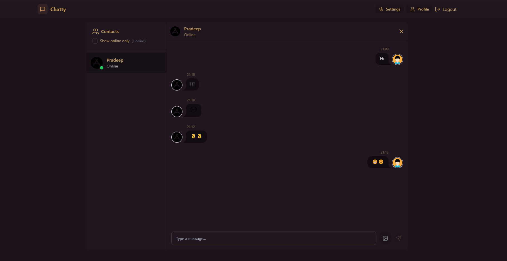

# 💬 Real-Time Chat Application

A modern real-time chat application built with React, Node.js, and Socket.IO, featuring JWT authentication and styled with Tailwind CSS + DaisyUI.

## 🚀 Live Demo

 <!-- Replace with your actual demo link -->

## ✨ Features

-   **Instant messaging** with Socket.IO
-   **Secure authentication** using JWT
-   **Tailwind CSS** for utility-first styling
-   **DaisyUI** for beautiful component library
-   **Online presence** indicators
-   **Message history** storage
-   **Fully responsive** design

## 🛠 Tech Stack

**Frontend**  

**Backend**  

## 🚀 Quick Start

### Prerequisites

-   Node.js v18+
-   MongoDB (local or [Atlas](https://www.mongodb.com/atlas))
